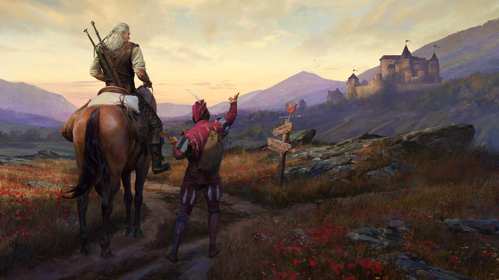
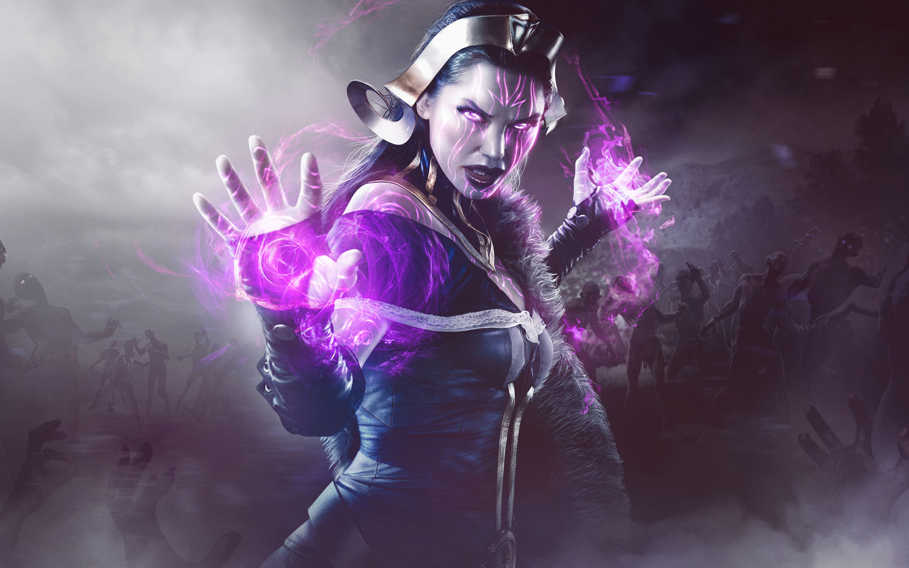

# ccg-notes
## Description 

Sometimes I find time to play CCGs and write a couple of notes on the material I studied. This repository stores information about various concepts and mechanics of various CCGs (Gwent, MTG, etc.), which I learned on streams, on reddit and in the game itself. Also you can find here analysis of cards, math proofs and tips.

## Table of Contents

- [Artifact](#Artifact) - Valve, when? :)
- [Gwent](#Gwent) - retired.
- [Legends of Runeterra](#Legends-of-Runeterra) - ?
- [Magic: The Gathering](#Magic-The-Gathering)

## Artifact

## Gwent

### Useful links

#### Academy

Educational articles and glossary from Team Aretuza: [link](https://teamaretuza.com/academy/)

#### Forums

CDPR's official forum:[link](https://forums.cdprojektred.com/forum/en/gwent)

Reddit: [link](https://www.reddit.com/r/gwent/)

### Meta

Meta snapshot from Team Aretuza & Team Nova: [link](https://teamaretuza.com/meta-snapshot/)

Meta snapshot from Team Leviathan Gaming: [link](http://teamleviathangaming.com/meta/)

### My favorite players/streamers/content creators

FreddyBabes - [twitch](https://www.twitch.tv/freddybabes/), [youtube](https://www.youtube.com/channel/UCuI2taB-tDeKLYDK9nfT4sw)

Shinmiri - [twitch](https://www.twitch.tv/shinmiri2)

SirPumpkn - [twitch](https://www.twitch.tv/sirpumpkn), [youtube](https://www.youtube.com/channel/UCvn-fnidHmMVhxwtc3utejA)

### Deck builders and netdecks

GwentUp decks and deck builder: [link](https://gwentup.com/)

Playgwent netdecks: [link](https://www.playgwent.com/en/decks/)

### Calculators

Hypergeometric calculator: [link](http://stattrek.com/online-calculator/hypergeometric.aspx#faq)

Overlap calculator: [link](https://jscalc.io/calc/XXJbvsNuHPUbtG8A)

### Other links

Gwent ALL premiums: [link](https://www.youtube.com/playlist?list=PL2YQeoVEJkjPDY_OfFsmtTNpeDrG7pHU9)

Gwent quizzes and voicelines on different languages: [link](https://gwent.seven7y.com/)

Gwent sounds: [link](https://soundcloud.com/gwentsounds/sets)

Unreleased Content: [link](http://gwent.wikia.com/wiki/Unreleased_Content)

## Legends of Runeterra

## Magic: The Gathering

### Useful links

#### Academy

[LEVEL ONE: THE FULL COURSE by Magic Withards](https://magic.wizards.com/en/articles/archive/level-one/level-one-full-course-2015-10-05).

[MAGIC: THE GATHERING 101 – DECK BUILDING FUNDAMENTALS](https://geekandsundry.com/magic-the-gathering-101-deck-building-fundamentals/).

[GETTING INTO MAGIC: THE GATHERING – COLOR PROFILES AND ARCHETYPES](GETTING INTO MAGIC: THE GATHERING – COLOR PROFILES AND ARCHETYPES).

[MTG Deck Building Guide – 9 Tips To Win More Games](https://cardgamebase.com/mtg-deck-building-guide-tips/).

[EDHREC](https://edhrec.com/) for information on deck building for the commander format (EDH -- Elder Dragon Highlander -- was the community name for the format before Wizards of the Coast gave it an official name).

Everything: [link](https://modernnexus.com/).

#### Cards, lore, prices

[Scryfall](https://scryfall.com/advanced) for searching for cards and information about cards.

[The Wiki](https://mtg.gamepedia.com/Main_Page) for learning more about Magic: The Gathering's cards, characters, worlds, and history.

[A BRIEF VISIT TO SOME OF THE PLANES OF MAGIC: THE GATHERING (PART 1)](https://geekandsundry.com/a-brief-visit-to-some-of-the-planes-of-magic-the-gathering/).

[What Should MTG Beginners Buy](https://cardgamebase.com/what-to-buy-for-mtg-beginner/).

[TCGPlayer](https://www.tcgplayer.com/) is a good place to find the prices of cards.

For all your magic needs in Europe - [cardmarket](https://www.cardmarket.com/de/Magic).

[Goldfish](https://www.mtggoldfish.com/).

#### Forums

[This subreddit](https://www.reddit.com/r/magicTCG/) for questions you may have.

#### News and Rotation Guide

[MythicSpoiler](http://mythicspoiler.com/newspoilers.html) and [MagicSpoiler](http://www.magicspoiler.com/spoiler-news/) for news about new cards and sets (+subreddit)

[FALL 2019 ROTATION GUIDE](https://forums.mtgarena.com/forums/threads/57075/comments/325887).

#### Stores

[WotC store locator](https://locator.wizards.com/event-reservations-web/?searchType=stores&query=London, UK&distance=10&page=1&sort=date&sortDirection=asc).

#### Meta

???

#### My favorite players/streamers/content creators

[Tolarian Community College (The Professor)](https://www.youtube.com/user/tolariancommunity/videos) frequently makes videos reviewing official Magic products (decks, sets, etc), as well as third-party functional products (deck boxes, card storage, cards sleeves, etc). If you're considering purchasing something for Magic, it's worth looking to see what The Professor had to say about it if he happened to review the product already. 

> I've bought products like binders and deck boxes on impulse, or without comparing options, just to find out that they're not the greatest products to be spending my money on.

[Ben Stark](https://www.youtube.com/channel/UCayul8sNRs5TatadTyYh4Eg) is one of the best limited minds MTG has, and he almost exclusively streams limited. 

> He teaches pick by pick, explaining the overall goal and what the meta for the set is. His guidance and insight got me to Mythic the first two seasons and continues to make me better. Legend is great too, I’ve followed him since the old console client Magic: Duels days, and he’s consistent.

[LegenVD](https://www.youtube.com/user/LegenVD) is great in Draft. He spends lots of time making and explaining his picks or different options. LegenVD makes videos about different decks in Standard and Modern for MTGO, his content is also applicable for different kinds of players.

[LSV](https://www.twitch.tv/LSV) also does limited set reviews on Channel Fireball.

[CalebD](https://www.youtube.com/channel/UCLYO-CiS0e8Yhs-U1k6ZmXQ) - the perfect mix of serious magic, stupid decks, snarky commentary, and good music.

> Especially if you enjoy great music and sarcasm.

[MTG Goldfish](https://www.youtube.com/channel/UCZAZTSd0xnor7hJFmINIBIw) has interesting deck techs and video series, for all kinds of players, podcasts.

[Channel Fireball](https://www.youtube.com/user/ChannelFireball) has videos from pro players for different formats, those are also really useful.

[Kenji Egashira](https://www.youtube.com/user/NumotTheNummy) aka "Numot the Nummy" has an YT channel and he also streams on a regular basis. He usually plays drafts and cubes on MTGO.

[Magic Aids](https://www.youtube.com/channel/UClaWphnKi16UJxRdkmFpw3A) is great deck builder and brews some interesting decks (mostly modern).

> but his humor can be... let's say it is not for everyone. 

[Loading Ready Run](https://www.youtube.com/user/loadingreadyrun)'s:

- Tap Tap Concede - Casual podcast about magic in general, though they often talk about draft/limited at the beginning during their crack a pack. Otherwise, depending on who's available for the specific episode, gives some insight on different perspectives from the hosts.
- North 100 - Where they talk about the Canadian Highlander format. Giving you ideas on what to add/remove, how to build an archetype, etc. Generally it's also a great podcast for brewing decks, exploring things, and how to properly play in similar competitive formats like 1 vs 1 Commander.
- Friday Nights - On-going comedy series that Wizards of the Coast supports.

[Jim Davis](https://www.youtube.com/user/jimdownside) - long MTGO game plays.

[StrictlyBetterMtG](https://www.youtube.com/channel/UCpZCNYMXJI_ptSBD3t47NOQ) - budget decks.

#### Deck builders and netdecks

[Archidekt](https://archidekt.com/) is a good place to build decks, and is growing in popularity over other deck building websites.

[Goldfish](https://www.mtggoldfish.com/).

#### Other links
