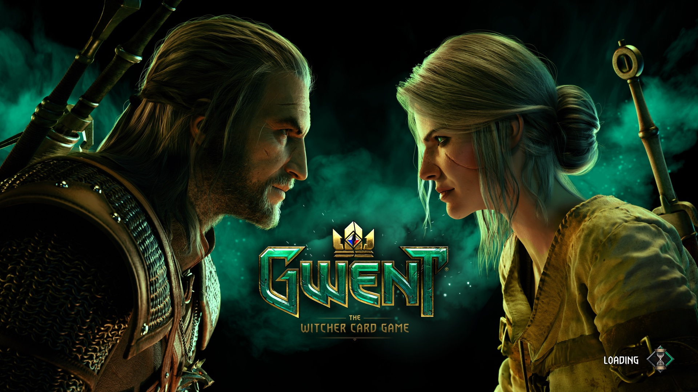

# gwent-notes
## Description 

Sometimes I find time to play Gwent and write a couple of notes on the material I studied. This repository stores information about concepts and mechanics of Gwent, which I learned on the streams, on reddit and in the game itself. Also you can find here analysis of cards, math proofs and tips concerning cards.

# Useful links 
## Guide links

Old guide to Acronyms in GWENT Discussions on CDPR's forum:  [link](https://forums.cdprojektred.com/forum/en/gwent/tactician-s-corner/7659900-guide-to-acronyms-in-gwent-discussions-what-do-all-those-letters-mean). You need to know this to talk with people on reddit and watch streams.

Meta snapshot from Team Aretuza: [link](https://teamaretuza.com/homepage/article/meta-snapshot-1-TSNa)

## Deck treckers

GwentUp deck tracker: [link](https://gwentup.com/)

Also there is a link to the meta report archive from GwentUp team: [link](https://gwentup.com/reports). You should see this to know your opponents and the best meta decks.

## Calculators

Hypergeometric calculator: [link](http://stattrek.com/online-calculator/hypergeometric.aspx#faq)

Overlap calculator: [link](https://jscalc.io/calc/XXJbvsNuHPUbtG8A)

## Other links

Gwent sounds: [link](https://soundcloud.com/gwentsounds/sets)

Gwent voicelines on different languages: [link](https://gwent.seven7y.com/)

Gwent ALL premiums: [link](https://www.youtube.com/watch?v=h0PsacSUa54)

Unreleased Content: [link](http://gwent.wikia.com/wiki/Unreleased_Content)